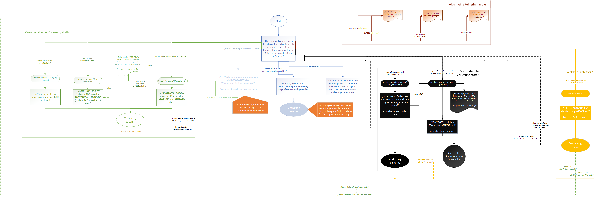

# Stundenplan Bot

## Übersicht

## Dialog-Diagramm

## Installationsschritte

### Hinweise

Es empfiehlt sich beim Durchführen der Installationsschritte nur mit einem Google-Account angemeldet zu sein. Durch Fehler im Mutliaccount-Handling über die verschiedenen Services hinweg, kann es passieren, dass Schritte nicht ohne weiteres durchgeführt werden können.

### Firebase Backend Setup

#### Projekt anlegen

Zunächst muss unter<https://console.firebase.google.com/> ein neues Projekt erstellt werden.

#### Firestore aktivieren

Hierzu wählt man zunächst in der Sidebar den Punkt _Database_ aus.

Anschließend wird die Anlage eines _Firestore_ direkt angeboten.

Hierbei ist es wichtig den _Firestore_ im Testmodus zu starten. Das erlaubt uns in der Folge die Kalenderdaten von außen in die Datenbank zu importieren.

#### Firestore Credentials herunterladen

Die Credentials zur Kommunikation mit dem _Firebase_-Projekt sind den Projekteinstellungen zu entnehmen.

Hier navigieren wir zum Punkt _Dienstkonten_ und wählen _Firebase Admin SDK_.

Aus den gezeigten Code-Snippets entnehmen wir die URL, diese wird später benötigt. Außerdem erzeugen wir durch einen Klick auf _Neuen privaten Schlüssel generieren_ die Credentials.

#### Firestore mit Kalendereinträgen füllen

Mit diesen Daten verfahren wir so:

* Schlüssel in Projekt _firebase-schedule-import_ unter `src/main/resources` ablegen.
* In der `Main.java` in `src/main/java` das Feld `FIRESTORE_URL` durch die URL aus den Projekteinstellungen ersetzen.

Jetzt führen wir den Datenbankimport mittels `./gradlew run` aus (Java-Installation erforderlich).

Anschließend steht die Datenbank für den Bot zu Verfügung.

##### Kalendereinträge

Als Basis für die Kalendereinträge wird ein aggregierter Stundenplan verwendet. Diesen kann man mittels _Mein Stundeplan_ generiert werden.

In diesem Fall wurde der Stundenplan <http://services.informatik.hs-mannheim.de/stundenplan/index.php?fach_p%5B%5D=BWL1%401CSB&fach_p%5B%5D=EI%401CSB&fach_p%5B%5D=GAT%401CSB&fach_p%5B%5D=MA1%401CSB&fach_p%5B%5D=PR1-L%401CSB&fach_p%5B%5D=PR1%3DI%401CSB&fach_p%5B%5D=T-MA1%401CSB&fach_p%5B%5D=EI%401IB&fach_p%5B%5D=MA1%401IB&fach_p%5B%5D=NF%401IB&fach_p%5B%5D=PR1-L%401IB&fach_p%5B%5D=PR1%3DI%401IB&fach_p%5B%5D=TEI1%401IB&fach_p%5B%5D=TEI1-L%401IB&fach_p%5B%5D=AMR%401IM&fach_p%5B%5D=COM%3DI%401IM&fach_p%5B%5D=DTP%401IM&fach_p%5B%5D=EBK%401IM&fach_p%5B%5D=GAE%401IM&fach_p%5B%5D=KDM%401IM&fach_p%5B%5D=KRY%401IM&fach_p%5B%5D=MMI%401IM&fach_p%5B%5D=NNW%401IM&fach_p%5B%5D=PPR%401IM&fach_p%5B%5D=SMA%401IM&fach_p%5B%5D=EI%401IMB&fach_p%5B%5D=MA1%401IMB&fach_p%5B%5D=MED1%401IMB&fach_p%5B%5D=MI1%401IMB&fach_p%5B%5D=PR1-L%401IMB&fach_p%5B%5D=PR1%3DI%401IMB&fach_p%5B%5D=T-MA1%401IMB&fach_p%5B%5D=MA2%402IB&fach_p%5B%5D=PR2-L%402IB&fach_p%5B%5D=PR2%3DI%402IB&fach_p%5B%5D=SE1%3DI%402IB&fach_p%5B%5D=TEI2%402IB&fach_p%5B%5D=THI%402IB&fach_p%5B%5D=THI-%DC%402IB&fach_p%5B%5D=AMR%402IM&fach_p%5B%5D=COM%3DI%402IM&fach_p%5B%5D=DTP%402IM&fach_p%5B%5D=EBK%402IM&fach_p%5B%5D=GAE%402IM&fach_p%5B%5D=KDM%402IM&fach_p%5B%5D=KRY%402IM&fach_p%5B%5D=MMI%402IM&fach_p%5B%5D=NNW%402IM&fach_p%5B%5D=PPR%402IM&fach_p%5B%5D=SMA%402IM&fach_p%5B%5D=DM%3DI%403IB&fach_p%5B%5D=MA3%403IB&fach_p%5B%5D=PP%3DI%403IB&fach_p%5B%5D=PR3%3DI%403IB&fach_p%5B%5D=SE2%3DI%403IB&fach_p%5B%5D=WEB%403IB&fach_p%5B%5D=DM%3DI%403IMB&fach_p%5B%5D=MA3%403IMB&fach_p%5B%5D=MI3%403IMB&fach_p%5B%5D=MI4%403IMB&fach_p%5B%5D=SE2%3DI%403IMB&fach_p%5B%5D=WEB%403IMB&fach_p%5B%5D=SEP%404IB&fach_p%5B%5D=BIM%3DI%406IB&fach_p%5B%5D=GDV%406IB&fach_p%5B%5D=IGT%406IB&fach_p%5B%5D=MBI%406IB&fach_p%5B%5D=SMA%406IB&fach_p%5B%5D=SQUAD%406IB&fach_p%5B%5D=VS%406IB&fach_p%5B%5D=WAF%406IB&fach_p%5B%5D=WIA%406IB&fach_p%5B%5D=BIM%3DI%406IMB&fach_p%5B%5D=GDV%406IMB&fach_p%5B%5D=IGT%406IMB&fach_p%5B%5D=MBI%406IMB&fach_p%5B%5D=MED3%406IMB&fach_p%5B%5D=MLD%406IMB&fach_p%5B%5D=SMA%406IMB&fach_p%5B%5D=SQUAD%406IMB&fach_p%5B%5D=VS%406IMB&fach_p%5B%5D=WAF%406IMB&fach_p%5B%5D=WIA%406IMB&fach_p%5B%5D=ZMP%406IMB&fach_p%5B%5D=AGI%407IB&fach_p%5B%5D=APV%407IB&fach_p%5B%5D=CVIS%407IB&fach_p%5B%5D=GAE%407IB&fach_p%5B%5D=LSD%407IB&fach_p%5B%5D=MLE%407IB&fach_p%5B%5D=SSE%407IB&fach_p%5B%5D=VS%407IB&fach_p%5B%5D=WIA%407IB&fach_p%5B%5D=AGI%407IMB&fach_p%5B%5D=APV%407IMB&fach_p%5B%5D=CVIS%407IMB&fach_p%5B%5D=LSD%407IMB&fach_p%5B%5D=MED3%407IMB&fach_p%5B%5D=MLD%407IMB&fach_p%5B%5D=MLE%407IMB&fach_p%5B%5D=SSE%407IMB&fach_p%5B%5D=VS%407IMB&fach_p%5B%5D=WIA%407IMB&fach_p%5B%5D=ZMP%407IMB&msp=1&pplan=weiter> verwendet. Er enthält alle Vorlesungen der Fakultät Informatik.

Dieser ist außerdem im Projekt unter `/src/main/resources` abgelegt, und kann verwendet werden, wenn die URL nicht mehr funktionieren sollte. Diesen muss man über HTTP zur Verfügung stellen, sodass diese von JSoup ausgelesen werden kann. Das Feld `calendar_uri` in `Main.java` ist hierzu zu ersetzen.

### Dialogflow and Fulfillment Setup

#### Dialogflow Agenten erstellen

Zunächst erstellen wir unter <https://console.dialogflow.com> einen neuen Agenten.

Hierbei wählen wir als _Google_-Projekt das zuvor erstellte _Firebase_-Projekt aus.

#### Agenten importieren

In den nun erstellen Agenten importieren wir jetzt die Intents und Entities. Hierzu wählt man in den _Projekteinstellungen > Export and Import_.

Wir wählen _Import_ und wählen das im Projekt _dialogflow-stundenplan-bot_ enthaltene `.zip` aus.

Anschließend sollten _Intents_ und _Entities_ vorhanden sein.

#### Fulfillment aufsetzen

Im `.zip` ist zwar auch die Anbindung an den _Firestore_ enthalten, dieser wird jedoch gegenwärtig nicht importiert. Daher muss das _Fulfillment_ über die Dialogflow Console konfiguriert werden. Hierzu wechseln wir in _Fulfillment_ in der Sidebar.

Hier aktivieren wir den _Inline Editor_ und klicken als nächstes auf _Deploy_ um die Beispielanbindung zu deployen. Hierbei wird im zuvor angelegten _Firebase_-Projekt eine _Cloud Function_ erzeugt. Diese Dient als Brücke zwischen dem Dialogflow Agenten und dem Firestore.

Das Deployment der Beispielfunktion als Zwischenschritt ist notwendig, da das Erstdeployment mit der tatsächlichen Cloud-Function derzeit fehlschlägt.

Ist das Deployment der Beispielfunktion abgeschlossen können wir die eigentliche Funktion importieren. Hierzu kopieren wir die Inhalte von `functions_index.js` und `package.json` in `dialogflow-stundeplan-bot/functions` in die entsprechenden Editortabs und führen anschließend ein erneutes Deployment aus.

:exclamation: Dialogflow meldet das erfolgreiche Deployment der Funktion, es hat sich jedoch gezeigt, dass das leider meistens nicht korrekt ist. Man muss sich noch einige Augenblicke mehr gedulden bis das Deployment tatsächlich abgeschlossen ist.

#### Agenten testen

Nach erfolgreichem Deployment können wir den Agenten in der Konsole testen.

